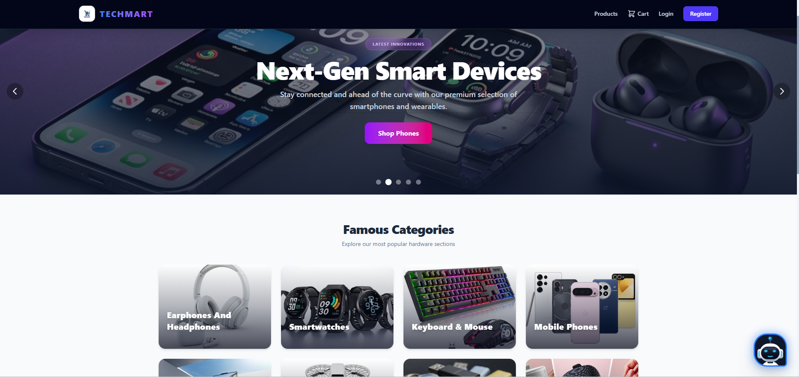
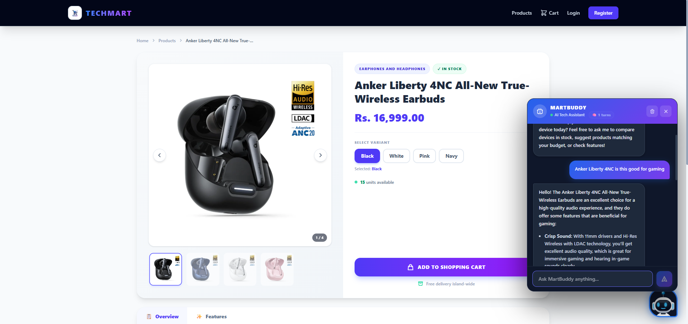

# 🛒 TechMart - Premium Full-Stack E-Commerce Platform

TechMart is a responsive, feature-rich full-stack e-commerce web application designed for selling high-end tech gadgets, developer gear, and smart office accessories.

This project was built to demonstrate proficiency in modern web development, scalable architecture, and full-stack integration. It features a robust **C# ASP.NET Core API** backend, a premium **React (Vite)** frontend styled with **Tailwind CSS**, and a comprehensive **Admin Dashboard** for complete store management.

<div align="center">
  
</div>

<div align="center">
  
</div>

---

## 🚀 Key Features & Functionality

### 🤖 MartBuddy - AI Shopping Assistant
- **Google Gemini Integration**: A fully integrated AI conversational chatbot powered by the Gemini API.
- **Context-Aware Recommendations**: The AI has real-time access to the live product inventory (prices, stock, specifications). It analyzes customer requirements (budget, usage, brand preference) and recommends actual available products.
- **Feedback Collection**: MartBuddy proactively asks users for feedback on recently purchased products that haven't been reviewed yet.
- **Smart Conversational UI**: Features an interactive, sliding chat widget on the storefront allowing users to chat with the assistant, complete with chat history management.

### 🛍️ Storefront & Shopping Experience
- **Interactive Product Catalog**: Search, filter by category division, and view detailed gadget specifications, multiple additional images, and product variants (e.g., colors).
- **Hybrid Cart System**:
  - **Registered Users**: Database-persisted shopping carts synced across devices.
  - **Guest Users**: Session-cached local storage shopping carts allowing users to shop without creating an account.
- **Flexible Guest Checkout & Fast Checkout**: Complete guest orders by providing delivery coordinates. Registered users have their saved profiles automatically fill in checkout details for faster purchases.
- **Cash on Delivery (COD)**: Quick order placement with "Delivery on Pay" confirmation.
- **Product Reviews & Ratings**: Customers and guests can leave 1-5 star ratings and comments on products, displaying aggregated feedback on product pages.
- **LKR Currency Integration**: All prices, subtotals, and invoice charges are automatically formatted in Sri Lankan Rupees (Rs. / LKR).

### 🛠️ Admin Dashboard (Management Console)
- **Business Performance Analytics**: High-impact metrics cards tracking Total Revenue, Orders, Customers, Products, Categories, and Low Stock Alerts.
- **Product Management**: Create, delete, and perform inline price/stock edits. Upload multiple product images and define product variants.
- **Visual Category Manager**: Add and update product tags, including custom Category Image headers rendered on the storefront.
- **Order Processing Center**: Track and manage order parameters. View complete recipient details and dynamically update order statuses (*Pending, Processing, Shipped, Completed, Cancelled*).
- **Customer Analyzer**: Track customer registration history, total order counts, and overall spending metrics.

---

## 🏗️ Architecture & Technology Stack

The application follows a clean, decoupled architecture separating the presentation layer from business logic and data access.

### Backend (Web API)
- **Framework**: ASP.NET Core Web API (.NET 8)
- **ORM**: Entity Framework (EF) Core
- **Database**: 
  - **SQLite** (Development)
  - **PostgreSQL** via Npgsql (Production)
- **Security**: JWT (JSON Web Tokens) Authentication
- **Documentation**: Swagger UI

### Frontend (Client UI)
- **Library**: React (bootstrapped with Vite)
- **Styling**: Tailwind CSS for modern, responsive aesthetics
- **State Management**: React Context API (AuthContext)
- **Routing**: React Router DOM
- **HTTP Client**: Axios

---

## 🧠 Design Patterns & Best Practices Used

This project heavily implements industry-standard design patterns to ensure the codebase remains maintainable, scalable, and testable:

1. **Repository Pattern**: Data access logic is abstracted using `IRepository<T>` and `Repository<T>`, decoupling the database implementation from the business logic.
2. **Service Layer Pattern**: Business rules and operations are centralized in services (`AuthService`, `ProductService`, `OrderService`), keeping Controllers lean and focused purely on HTTP routing.
3. **Dependency Injection (DI)**: Inversion of Control is achieved via ASP.NET Core's built-in DI container, injecting repositories and services into controllers.
4. **DTO (Data Transfer Object) Pattern**: Used extensively to shape data payloads between the client and server, preventing over-posting and hiding internal domain models.
5. **RESTful API Design**: Endpoints are structured cleanly using standard HTTP verbs (GET, POST, PUT, DELETE) and conventional routing.

---

## 🗄️ Database Schema & Domain Models

The relational database is normalized and consists of the following core entities:
- `User`: Manages authentication credentials, role-based access (Admin/Customer), and saved shipping addresses.
- `Product`: Stores item details, pricing, stock count, variant configurations, and image galleries.
- `Category`: Categorization entity for grouping products.
- `Cart` & `CartItem`: Manages active shopping sessions and selected variant quantities.
- `Order` & `OrderItem`: Immutable records of completed transactions, shipping details, and historical prices.
- `Review`: Stores product ratings, feedback, and links to registered users or anonymous guest names.

*(See the `database_structure.md` artifact for a detailed Entity Relationship Diagram and column list).*

---

## ⚙️ Getting Started Locally

### Prerequisites
- [.NET 8.0 SDK](https://dotnet.microsoft.com/en-us/download/dotnet/8.0)
- [Node.js](https://nodejs.org/) (v18 or higher)
- Powershell, Command Prompt, or Git Bash

### 1. Database Setup & Migration
Navigate to the backend directory and apply migrations to build the SQLite database schema:
```bash
cd TechMart.API
dotnet ef database update
```

### 2. Start the Backend Server
Run the C# API locally (running at `http://localhost:5019`):
```bash
dotnet run
```
*Note: You can access the Swagger API documentation at `http://localhost:5019/swagger`*

### 3. Start the Frontend Client
Open a new terminal tab, navigate to the React UI directory, install dependencies, and run the developer server (running at `http://localhost:5173`):
```bash
cd TechMart.UI
npm install
npm run dev
```

---

## 📁 Project Structure

```text
+-- TechMart.API             # C# Backend Web API project (.NET 8)
|   +-- Controllers          # API endpoint definitions
|   +-- Data                 # DB context (ApplicationDbContext)
|   +-- DTOs                 # Data Transfer Objects
|   +-- Models               # Entity Framework Domain Models
|   +-- Repositories         # Repository implementations
|   +-- Services             # Business logic layer
|   +-- Program.cs           # Application entry point & DI container setup
|
+-- TechMart.UI              # React Frontend Client (Vite)
    +-- src
        +-- api              # Axios instance configs
        +-- components       # Reusable components (Navbar, Footer, ProductCard)
        +-- context          # React Context (AuthContext)
        +-- pages            # Views (Home, Products, Cart, AdminDashboard)
```


---

## ?? CRITICAL: Production Deployment & Database Migrations

When deploying the Web API to a production environment (like AWS EC2), the system uses **PostgreSQL**, whereas local development uses **SQLite**. 

Because Entity Framework Core migrations are **provider-specific**, you **CANNOT** run migrations generated for SQLite directly on a PostgreSQL database without risking severe schema mapping issues (like missing IDENTITY columns for auto-incrementing Primary Keys).

### How to deploy database changes properly:
1. **Never** run dotnet ef migrations add while pointing to the SQLite database if those migrations are meant for Production.
2. If you need to make schema changes for Production, you must temporarily change the DefaultConnection string in your local ppsettings.json to point to a PostgreSQL database, and **then** generate the migrations.
3. If you have already applied SQLite migrations to a Postgres database and face 500 Internal Server Error on inserts, you must manually execute ALTER TABLE "TableName" ALTER COLUMN "Id" ADD GENERATED BY DEFAULT AS IDENTITY; in psql to fix the missing auto-increment constraints.
